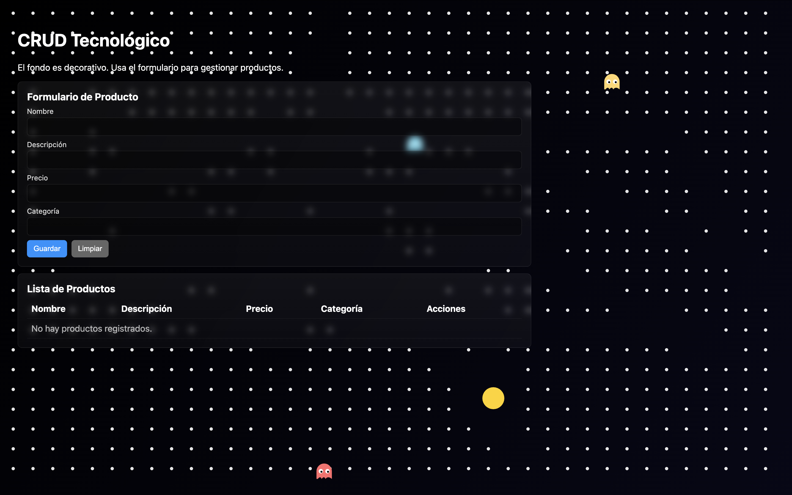

# CRUD de Productos

## Descripción
Aplicación web tipo CRUD para gestionar productos. Permite registrar, consultar, editar y eliminar registros desde una interfaz simple en el navegador, con persistencia local usando LocalStorage.

La entidad seleccionada es **Producto** y cada registro contiene 4 campos:
- Nombre
- Descripción
- Precio
- Categoría

## Tecnologías utilizadas
- HTML5
- CSS3
- JavaScript (Vanilla)
- Canvas API (animación de fondo)
- LocalStorage (persistencia de datos en navegador)
- Sweet Alert 2 (alertas mejoradas y confirmaciones)

## Funcionalidades
- ✅ Registrar nuevos productos
- ✅ Consultar lista de productos
- ✅ Editar productos existentes
- ✅ Eliminar productos
- ✅ Validación de campos obligatorios
- ✅ Alertas elegantes con Sweet Alert para todas las operaciones
- ✅ Confirmación visual para eliminaciones
- ✅ Fondo animado estilo juego de Pacman (decorativo)

## Diseño y funcionamiento del formulario
- El formulario está en una tarjeta principal y la tabla muestra los registros. El fondo es decorativo (animación estilo Pac‑Man) sin interferir con las interacciones del CRUD.
- El sitio incluye un fondo animado tipo Pacman (canvas) para dar apariencia de videojuego sin afectar las acciones del CRUD.
- Los campos del formulario (`Nombre`, `Descripción`, `Precio`, `Categoría`) son obligatorios.
- El botón **Guardar** crea un registro nuevo cuando no hay edición activa y muestra alerta de éxito.
- Al pulsar **Editar** en una fila, el formulario carga los datos del producto y cambia a modo edición.
- El botón **Actualizar** (cuando está en modo edición) guarda los cambios con alerta de confirmación.
- El botón **Limpiar** vacía el formulario y regresa al modo de registro.
- El botón **Eliminar** solicita confirmación mediante Sweet Alert antes de borrar.
- Los cambios se reflejan de inmediato en la tabla y se guardan en `LocalStorage`.
- Sweet Alert proporciona retroalimentación visual elegante para todas las operaciones (éxito, advertencia, error).

## Instrucciones para ejecutar el proyecto
1. Clonar el repositorio:
   ```bash
   git clone https://github.com/angelOcampoM/CrudTecnologico.git
   ```
2. Entrar a la carpeta del proyecto:
   ```bash
   cd CrudTecnologico
   ```
3. Abrir `index.html` en el navegador.
   - También puedes ejecutar un servidor local opcional:
     ```bash
     python3 -m http.server 8000
     ```
     y abrir `http://localhost:8000`.


## Evidencias / Capturas de pantalla
### Interfaz actual del sistema


La captura muestra:
- Formulario de registro con 4 campos (Nombre, Descripción, Precio, Categoría)
- Tabla de Lista de Productos vacía (lista para agregar productos)
- Botones funcionales (Guardar, Limpiar)
- Fondo decorativo animado con Pac-Man y fantasmas
- Interfaz limpia y responsiva

## Checklist de revisión (rúbrica)
- [x] Repositorio en GitHub
- [x] README completo
- [x] Interfaz funcional
- [x] Crear registros
- [x] Consultar registros
- [x] Editar registros
- [x] Eliminar registros
- [x] Organización del código

- estructurar el código base del CRUD,
- validar que se cumplieran los criterios solicitados.

El funcionamiento general del proyecto puede ser explicado paso a paso (estructura HTML, lógica CRUD en JavaScript, renderizado de tabla y persistencia con LocalStorage).
