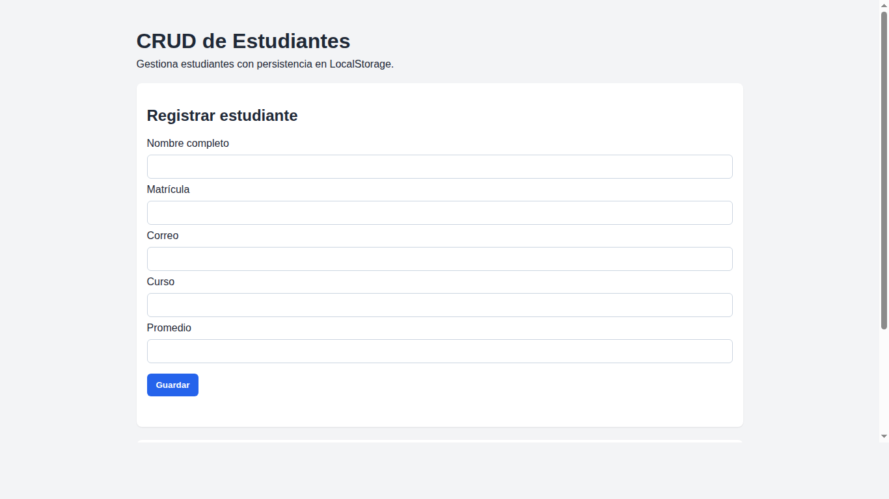

# CRUD de Estudiantes

## Descripción
Aplicación web tipo CRUD para gestionar estudiantes. Permite registrar, consultar, editar y eliminar registros desde una interfaz simple en navegador, con persistencia local usando LocalStorage.

La entidad seleccionada es **Estudiante** y cada registro contiene 5 campos:
- Nombre completo
- Matrícula
- Correo
- Curso
- Promedio

## Tecnologías utilizadas
- HTML5
- CSS3
- JavaScript (Vanilla)
- LocalStorage (persistencia de datos en navegador)

## Funcionalidades
- ✅ Registrar nuevos estudiantes
- ✅ Consultar lista de estudiantes
- ✅ Editar estudiantes existentes
- ✅ Eliminar estudiantes
- ✅ Validación de campos obligatorios y rango de promedio (0 a 10)
- ✅ Mensajes de estado para confirmar acciones

## Instrucciones para ejecutar el proyecto
1. Clonar el repositorio:
   ```bash
   git clone https://github.com/angelOcampoM/CrudTecnologico.git
   ```
2. Entrar a la carpeta del proyecto:
   ```bash
   cd CrudTecnologico
   ```
3. Abrir `index.html` en el navegador.
   - También puedes ejecutar un servidor local opcional:
     ```bash
     python3 -m http.server 8000
     ```
     y abrir `http://localhost:8000`.

## Evidencias o capturas de pantalla
Interfaz principal del sistema:



## Uso de Inteligencia Artificial
Sí se utilizó IA como apoyo para:
- organizar y redactar el README,
- estructurar el código base del CRUD,
- validar que se cumplieran los criterios solicitados.

El funcionamiento general del proyecto puede ser explicado paso a paso (estructura HTML, lógica CRUD en JavaScript, renderizado de tabla y persistencia con LocalStorage).
